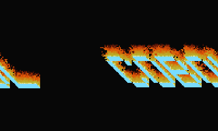

# 🔥 DOOM Fire + 2048 — in COBOL

The famous PSX **DOOM fire effect**, computed and rendered in **COBOL** — the
1959 language that still runs the world's banks, ATMs, and airline
reservations. No graphics library. Just `PERFORM`, `MOVE`, a 37-colour fire
palette, and Fabien Sanglard's fire-propagation algorithm.

COBOL writes every frame as raw 24-bit RGB; `ffmpeg` stitches them into video.




## The pitch (for the post)

> I wrote the DOOM fire effect in COBOL. Yes, *that* COBOL — the one banks run
> on. It computes the flame simulation and renders raw RGB frames with zero
> graphics libraries. Here it is setting the word "COBOL" on fire.

## Also: 2048, playing itself

**`GAME2048.cob`** is a complete 2048 — real rules (slide, single-merge per
move, 90/10 random 2/4 spawns) with a corner-stacking AI, rendered to
260×260 raw RGB frames: the authentic tile palette and a hand-drawn 3×5
pixel font for the numbers, all in COBOL. The self-play run becomes
`game2048.mp4`.


## How it works

1. **`DOOMFIRE.cob`** — a `200×120` heat grid (`OCCURS 24000`). The bottom row
   is white-hot (palette index 36). Each frame, every cell pushes heat upward
   with a random decay and sideways jitter — that's the whole fire. The grid
   renders to `fire.raw` as raw `rgb24` bytes (`FUNCTION CHAR` turns a 0–255
   value into a byte; a record-sequential file writes them with no delimiters).
2. **`COBOLFIRE.cob`** — same engine, but the heat source is the word **COBOL**
   (read from `mask.txt`) re-lit every frame, and the letter cells render in
   crisp cyan so the logo stays sharp while flames rise off it.
3. **`mkmask.py`** — draws "COBOL" with a hardcoded 5×7 font into the heat-source
   mask. No image libraries.
4. **`ffmpeg`** — reads the raw RGB stream and encodes MP4/GIF.

Exactly `200 × 120 × 3 × 320 = 23,040,000` bytes come out of COBOL per run —
byte-for-byte what a `rgb24` video of that size expects. Nothing fudged.

## Run it (record this for the "watch it build" clip)

```bash
./make.sh
```

Needs `cobc` (GnuCOBOL 3.x) and `ffmpeg`. ~9s to render 320 frames.

## Why this is a real flex, not a gimmick

COBOL is caricatured as batch payroll from 1959. It is also Turing-complete and
perfectly capable of a real-time-graphics algorithm — it just never gets asked.
This is ~180 lines doing per-pixel simulation and raw framebuffer output. The
language that clears trillions of dollars a day can also throw flames.

Built live, on camera, as part of the Perslis "make dead tech do new tricks"
series.
